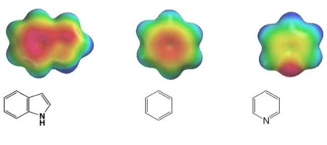
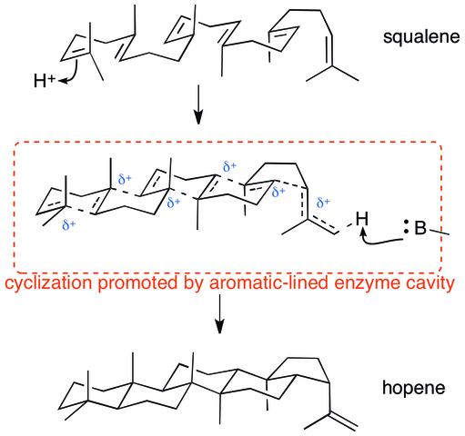
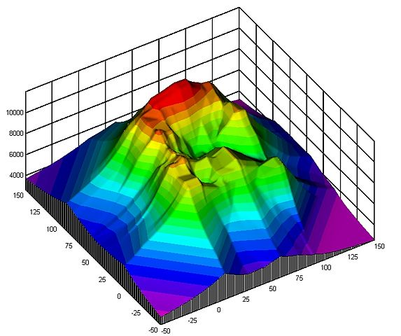
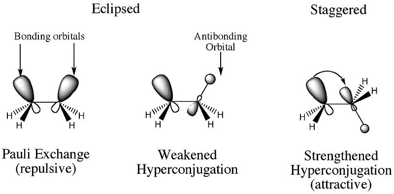

This is present.js

---

* This is a slide
* It has bullet points,
	* Sub-bullet points,
	* And so forth

---

* This is a slide
* It has bullet points
	* And sub bullet points
	* More sub bullets

1. What's this?
2. An ordered list?
3. You bet.

---

Test

* This is a bullet
* This is another bullet
* Yet another

---

Prepare for random science images

---

---

Ring closure reaction

Some random contour graph--fantastic!

---

* Lorem ipsum
* Dolor sit amet
* Electrostatic Density Plots, yay!
* Consectetuer adipiscing elit

---

---

---

---

