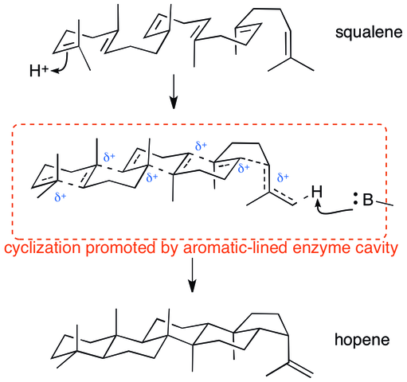
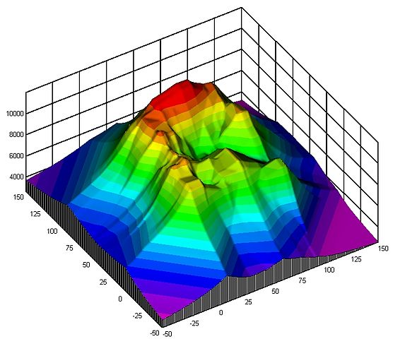
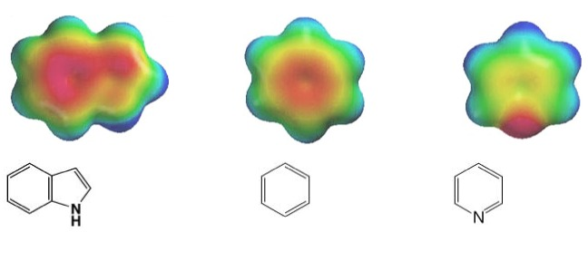

This is present.js

---

* This is a slide
* It has bullet points,
	* Sub-bullet points,
	* And so forth

---

* This is the same list 
* It has bullet points,
	* Sub-bullet points,
	* And so forth

1. What's this?
2. An ordered list?
3. You bet.

---

Test

* Something 
* Something else

---

Prepare for random science images

---

---

---

---

---

Ring closure reaction

Some random contour graph--just 
fantastic!

---

* Lorem ipsum
* Dolor sit amet
* Consectetuer adipiscing elit
* Electrostatic Density Plots, yay!
* THIS IS THE LAST SLIDE.
